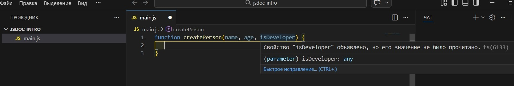
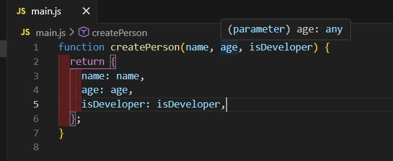
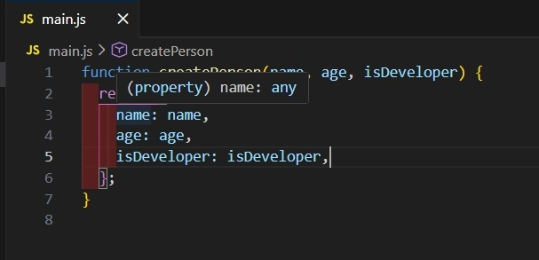
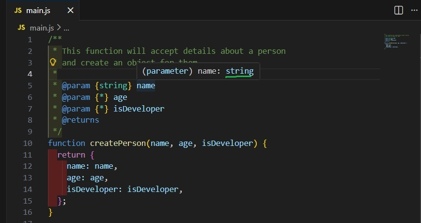

#### This function is going to be returning an object with three properties 

```js
function createPerson(name, age, isDeveloper) {
  return {
    name: name,
    age: age,
    isDeveloper: isDeveloper,
  };
}
```

Note: So now lets actually create a function
-  in which we`ll be documenting using JSDoc
-   and call this function `createPerson` 
   -  as the name implies this function is going to be creating a person


#### Declaring the function `createPerson` in VSCode



Note: so gonna be accepting a `name`, an `age` 

- and also another parameter called `isDeveloper` basically just a boolean 
- to say is this person a developer 


#### this function is going to be returning an object with three properties



Note: of course it&#39;s going to be named

- `name`  as being `name` ,
- `age`  as being `age` 
- and `isDeveloper` as being `isDeveloper` 
- and as we see VSCode is typing the parameters as `any`


#### VSCode is typing the values of properties as `any`



Note: as we see

-  and obviously by looking at this function you may notice
- that the `name` parameter is gonna be of type `string`
-  the `age` is gonna be a `number` 
- and `isDeveloper` is gonna be a `boolean`


#### This function is simple

```js
function createPerson(name, age, isDeveloper) {
  return {
    name: name,
    age: age,
    isDeveloper: isDeveloper,
  };
}
```

Note:  and that is obviously quite acceptable to assume given the simple nature of this function


#### however if you have larger functions in more complex code

then it can be hard to determine 

- what it actually does?
-  and what these parameters types are ?
- and also what the function returns ?

Note:  so that is what JSDoc  is for I definitely recommend 


## a snippet for a JSDoc comment in Visual Studio code


Note:  so in most text editors 

- with an extension installed for JSDoc
  -  you can simply put forward `slash` 
  - and put `two asterisks` like this
  - if I press ENTER it&#39;s gonna generate for me the JSDoc comment


####  Visual Studio code is generatig the JSDoc comment

```js
/**
 * 
 * @param {*} name 
 * @param {*} age 
 * @param {*} isDeveloper 
 * @returns 
 */
function createPerson(name, age, isDeveloper) {
  return {
    name: name,
    age: age,
    isDeveloper: isDeveloper,
  };
}
```

Note:   for now let&#39;s just not worry about this parameters part


#### Adding a function description

```js
/**
 * This function will accept details about a person
 * and create an object for them
 *
 * @param {*} name
 * @param {*} age
 * @param {*} isDeveloper
 * @returns
 */
function createPerson(name, age, isDeveloper) {
  return {
    name: name,
    age: age,
    isDeveloper: isDeveloper,
  };
}
```

 in first row is gonna be your function description 

Note:   so we&#39;re gonna say for example 

- `This function will accept...` 
- again for this simple function this is quite useless
-  but of course for larger functions  - it&#39;s gonna be a lot more helpful
-  so that is where you put your function description 


#### Typing the first parameter of the function `createPerson`

```js
 /**
 ...
* @param {string} name
```



Note:   this right here in  line 5 this is how to specify a `type name for a parameter` 

- after tag `@param` within `curly braces` you put `the type of the parameter` 
- then followed by the actual `name of parameter`
  - inside here so for the parameter type we&#39;re gonna say
  -  in this case that&#39;s going to be a `string`
  -  so we simply put `string` in  `curly braces`


#### Now the parameter is supposed to be a string 


Note:   previously when it was an asterisk 

- within `curly braces` in  line 5
- it  just means that the parameter could be `anything` 
- of course by putting `string` it means
-  that the parameter is supposed to be a string 


#### describing the parameter

```js
 /**
 ...
* @param {string} name The person's full name
```

Note:   after the name of parameter

- we can describe the parameter
- for example we can say `The person's full name`


#### we can do the same thing for the rest parameters

```js
/**
 * This function will accept details about a person
 * and create an object for them
 *
 * @param {string} name The person's full name
 * @param {number} age The person's age
 * @param {boolean} isDeveloper Whether or not the person is a developer
 * @returns 
 */
function createPerson(name, age, isDeveloper) {
  return {
    name: name,
    age: age,
    isDeveloper: isDeveloper,
  };
}
```

that is basically how to specify your types and the descriptions for your parameters

Note:   we&#39;re gonna say `number` for `age` 

- and we can say `The person's age` 
- and for `isDeveloper` we&#39;re gonna obviously does parse in here `boolean` 
- and we&#39;re gonna say `Whether or not the person is a developer`