#### Visual Studio code has picked up the comment from JSDoc

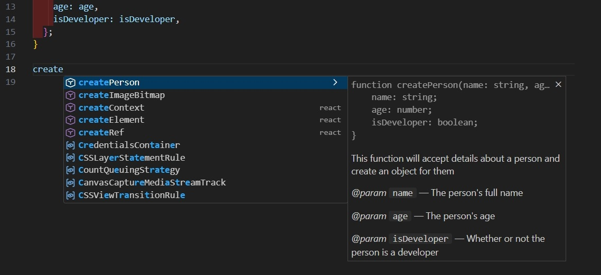

Note:  and when we start typing the name of function to invoke - we can see on the right  that Visual Studio code has picked up the JSDoc


#### The description of the function

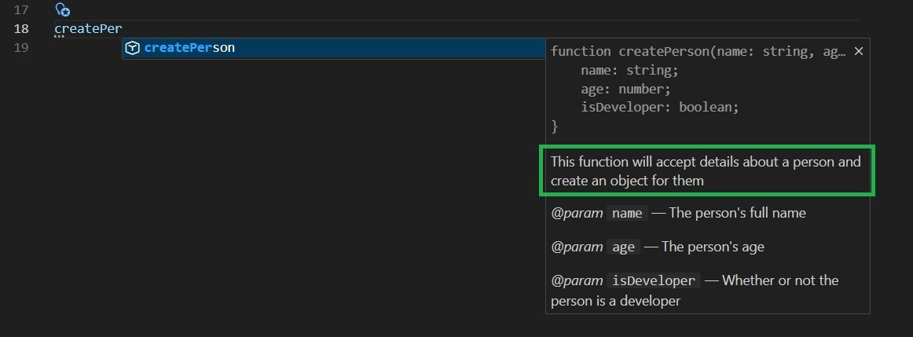

Note:   and it is telling us right here about the **description** of function `createPerson`


### the descriptions of the parameters

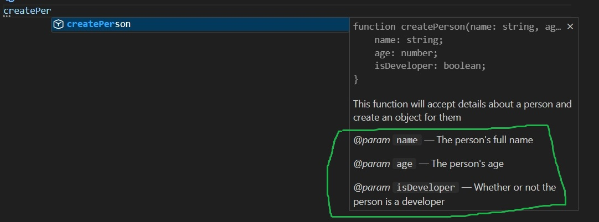

Note:   and it is telling us  the descriptions of the parameters


#### Showing types of the parameters which have been specified

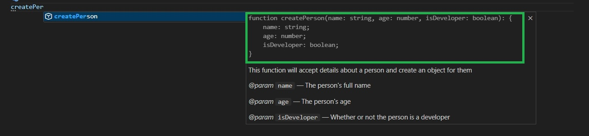

So, we can clearly see how JSDoc can be used to, for example, see data types when working with JavaScript code.

Note:   and also it is telling us the types of the parameters 

- which have been specified
- up here we can see `name` as being `string`,
- `age` - `number` and `isDeveloper` as being `boolean`


#### Showing types of the parameter inside the function

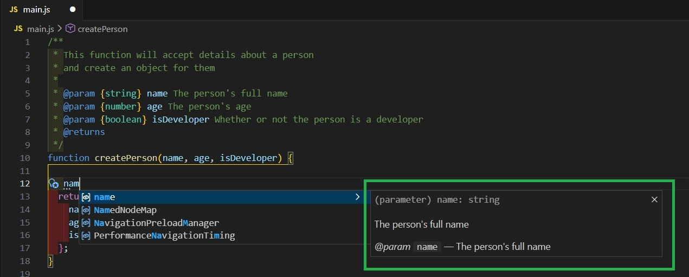

Note:   now and we&#39;re gonna also go inside the function

- and we&#39;re gonna try to write out a `name`
- as we can see here again on the right side we can see
- it knows it&#39;s a string 


#### if we put dot - we get all of the methods forward the `string`:

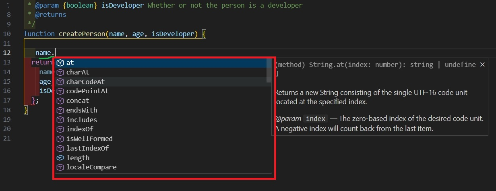

Note:  it knows it&#39;s a string 

- which means if I say dot 
- we get all of the methods forward the string:
- and this is just the feature of VSCode,
- because it knows how to read JSDoc and we can see once again how it can be useful in the functions 


#### annotation  for the return type

```js
 /**
 ...
* @returns {Object}
```

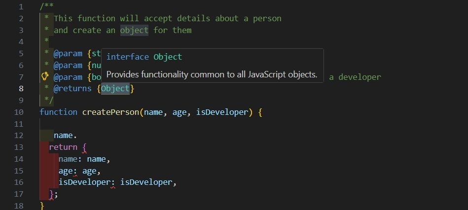

Note:  Okay, let's move on to another annotation

- which will be used for the return type. 
- Here, we'll use a very similar syntax: 
- we'll write "objects" in curly braces, like this.


#### Using description for the return type

```js
 /**
 ...
* @returns {Object} The  person object
```

also if you don&#39;t want to use this style for descriptions you can also put a dash :

```js
 /**
 ...
* @returns {Object} - The  person object
```

Note:  and we&#39;re gonna say as a description `The  person object` 


#### and that is perfectly fine

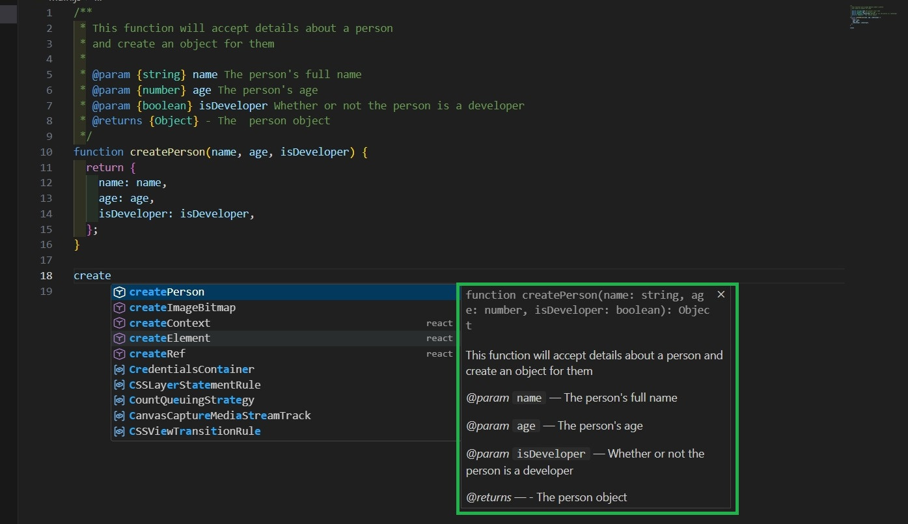

Note:  and that is perfectly fine okay


#### and now we have this well-documented function 

```js
/**
 * This function will accept details about a person
 * and create an object for them
 *
 * @param {string} name The person's full name
 * @param {number} age The person's age
 * @param {boolean} isDeveloper Whether or not the person is a developer
 * @returns {Object} The  person object
 */
function createPerson(name, age, isDeveloper) {
  return {
    name: name,
    age: age,
    isDeveloper: isDeveloper,
  };
}
```

Note:  so now we have this well-documented function

- let&#39;s export this to HTML


#### installing JSDoc

```shell
$ npm install -g jsdoc
```

and to export documentation on function  to HTML you simply say `jsdoc` and then provide the name of your file , in our case `main.js`:

```shell
$ jsdoc main.js
```

Note:   so obviously you don&#39;t need to export to HTML to take advantage of JSDoc

- however  it may be something to know 
- so anyway let&#39;s go  and open the terminal 
- and we&#39;re gonna be installing JSDoc on my system 
- so in order to do this using NPM 


#### here is gonna generate an HTML document inside the `out` directory right here:

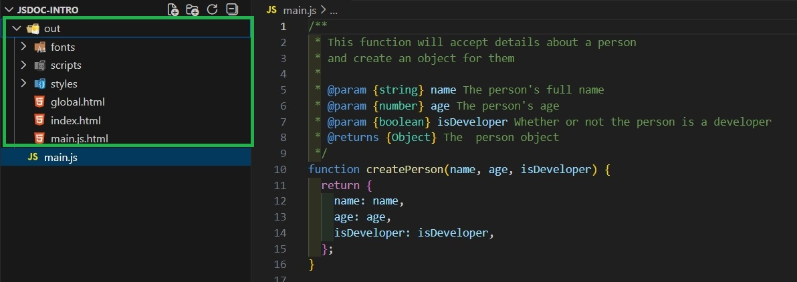

Note:   pressing enter

- and  here is gonna generate an HTML document inside the `out` directory


#### we get a nicely formatted HTML file that describes the documentation which we just wrote :

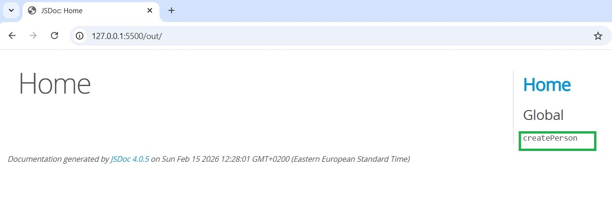

Note:   we get a nicely formatted HTML file that describes the documentation 

- which we just wrote 
- if I was to go on the right here we can press on `create person` under the global heading


#### we can see right there we get all the documentation which we just wrote:

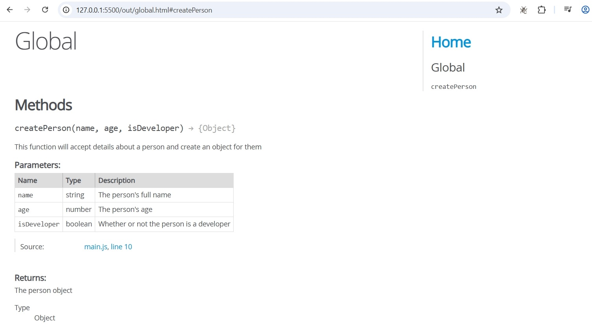

Note:   we can see right there we get all the documentation which we just wrote in a nice formatting


#### we get the function description:

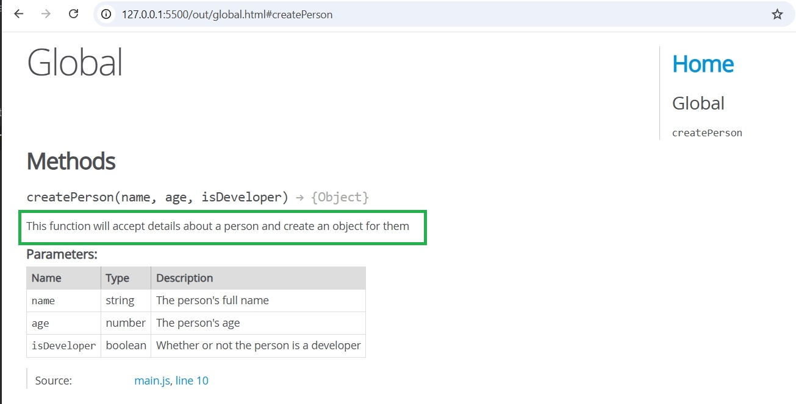

Note:   ok we get the function description


####  also we get that parameter list  - description and the source 

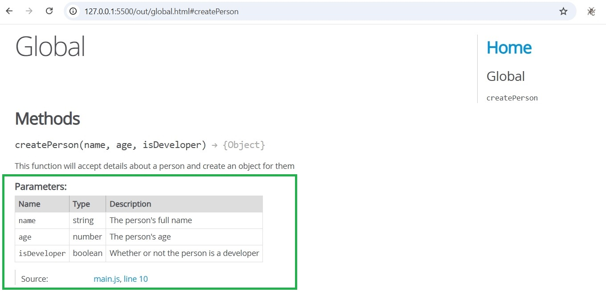

Note:   also we get that parameter list  - description and the source


#### and we get  the return table

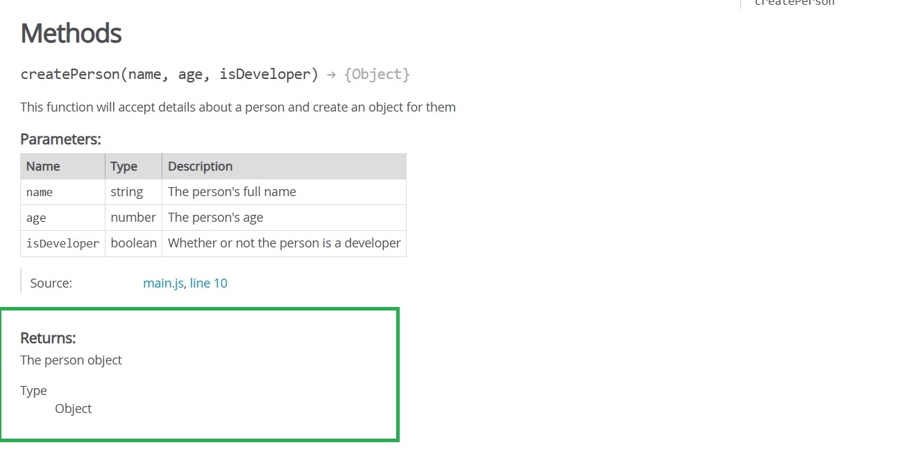

Note:   and we get  the return table

- So it's definitely useful as a reference, and if you want to, for example, maintain a larger codebase


#### documentation may override the computed type

```js
/**
 * @type {string}
 */
const foo1 = 123;

console.log(foo1.toUpperCase);

'123'.toUpperCase()
123.toUpperCase()
```

Note:   deliberately assigned the wrong type

- to show that documentation can override the computed type


#### Comments give us the opportunity to shed light on some issues.

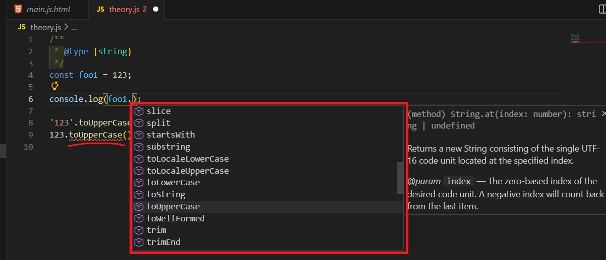

Note:   We see all the possibilities for working with strings,

- although in reality there's a number here. 
- As I say, documentation is more powerful than the calculated value


#### Let's add the following comment at the top of the page

```js
// @ts-check
```

Note:   I would like to have a backlight

- that will help us understand where the error is now


#### Thanks to the `@ts-check` instruction, TypeScript will perform additional checking and highlight where we have typing errors

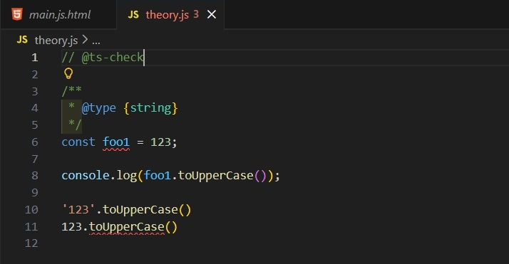

Note:   JSDoc tells us to fix this 

- make `foo2` a string


#### we can even type arrays and much more complex structures


Note:   This way we know in advance what should push into this array

- and we will get errors in advance


#### Conclusion

- JSDoc annotations and the `// @ts-check` directives will expand your capabilities and won't require you to change your existing tooling. 
- However, it's best to avoid overusing them.
-  Comment templates aren't always appropriate, as logic can easily get lost in the JSDoc maze.
- TypeScript works better with .ts files than with .js files, so it's best to switch to it.

Note:   The End
